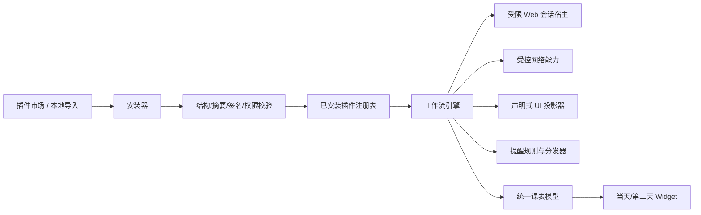

# 课表查看 V2 工作流插件引擎设计

日期：2026-04-27  
状态：已确认  
范围：插件市场、插件安装校验、受限 Web 登录、声明式课表 UI 扩展、自动闹钟、桌面组件切换显示

## 1. 背景

当前项目的插件系统是一个基于 QuickJS 的内置脚本执行模型，宿主按 `login -> fetchSchedule -> normalize` 固定顺序调用插件函数，再将结果解析为统一课表模型。

这套实现适合“内置、受信任、数量少”的插件场景，但已经无法满足以下新要求：

- 第三方插件可本地安装，也可远程安装
- 提供插件市场和插件校验
- 插件可发起受限网页登录流程
- 插件可扩展课表 UI，但不能直接接管原生界面
- 插件可参与自动闹钟配置与推荐
- 桌面组件需要展示当天/第二天课表并切换

在第三方插件默认不可信的前提下，继续扩展现有 `Host` 桥接会快速失控，因此本设计选择重建为“声明式工作流引擎”。

## 2. 设计目标

### 2.1 目标

- 支持第三方插件的本地导入与远程市场安装
- 所有插件在安装和运行前都必须经过结构、摘要、签名、权限与域名白名单校验
- 插件只能通过宿主暴露的受控能力完成网络、Web 登录、课表同步、提醒和 UI 扩展
- 课表主 UI 仍由宿主原生 Compose 渲染，插件只能提供结构化 UI 描述
- 自动闹钟采用“系统闹钟优先，宿主提醒降级”的混合策略
- widget 单次只显示一天课表，在“当天 / 第二天”之间切换

### 2.2 非目标

- 不允许第三方插件直接执行任意 Kotlin/Java 原生代码
- 不允许插件直接控制 Compose 组件树、ViewModel 或 Activity 生命周期
- 不建设一个完全开放的浏览器运行时给插件任意使用
- 不在第一阶段支持插件自定义 widget 布局

## 3. 总体方案

新的插件系统不再把插件视为“一个要执行的 JS 文件”，而是视为“一个受限的插件应用包”。

每个插件包包含：

- 插件身份与兼容信息
- 签名和摘要信息
- 权限与允许访问的目标站点
- 声明式工作流
- UI Schema
- 受限 Web 会话规范
- 静态数据包

宿主新增一个统一工作流引擎，用来解释执行这些声明，而不是让插件直接拿到高权限 API。



## 4. 模块划分

建议的模块边界如下：

- `app`
  - 应用入口、导航、依赖组装、系统 Activity/Intent 接入
- `core-kernel`
  - 保留统一课表模型与基础协议
- `core-plugin`（新增）
  - 插件包格式、manifest、权限模型、工作流定义、安装器、校验器、执行器
- `core-data`
  - 已安装插件注册表、插件授权记录、提醒规则、widget 视图状态等持久化
- `core-reminder`（新增）
  - 提醒规则、计划展开、系统闹钟分发、宿主降级提醒
- `feature-plugin`（新增）
  - 插件市场、插件详情、安装授权页、受限 Web 登录页
- `feature-schedule`
  - 课表主界面、UI 插槽渲染器、单课程/横向节次选择模式
- `feature-widget`
  - widget 投影、当天/第二天切换、轻量提醒标记
- `core-js`
  - 临时保留，仅用于迁移期兼容，最终退场

## 5. 插件包格式

### 5.1 安装包

建议定义插件安装包扩展名为 `*.csvplugin`。本质是一个 ZIP 包，但要求固定目录结构。

最小结构：

```text
demo-campus.csvplugin
├─ manifest.json
├─ workflow.json
├─ permissions.json
├─ checksums.json
├─ signature.json
├─ ui/
│  ├─ schedule.json
│  └─ actions.json
├─ web/
│  └─ login.json
└─ datapack/
   ├─ term-rules.json
   └─ slot-mapping.json
```

### 5.2 `manifest.json`

字段建议：

- `pluginId`
- `name`
- `publisher`
- `version`
- `versionCode`
- `minHostVersion`
- `targetApiVersion`
- `entryWorkflow`
- `description`
- `homepage`
- `supportUrl`
- `declaredPermissions`
- `allowedHosts`
- `dataPackVersion`

### 5.3 `checksums.json`

记录包内每个文件的摘要，用于安装前完整性校验。

### 5.4 `signature.json`

记录：

- 发布者公钥指纹
- 签名算法
- 被签名内容摘要
- 签名值
- 可选证书链或发布者声明

## 6. 插件市场与安装来源

### 6.1 本地安装

用户通过系统文件选择器导入 `*.csvplugin` 包。

流程：

1. 读取包
2. 校验结构
3. 校验摘要
4. 校验签名
5. 解析权限与允许访问的站点
6. 展示安装确认页
7. 用户确认后写入已安装插件注册表

### 6.2 远程安装

远程安装来自“插件市场索引”。

索引内容至少包含：

- 插件基本信息
- 最新版本信息
- 下载 URL
- 摘要
- 发布者信息
- 市场签名

流程：

1. 拉取索引
2. 校验索引签名
3. 展示插件列表
4. 下载插件包
5. 复用本地安装的全部校验流程

### 6.3 开发者模式

为了支持本地调试，可提供开发者模式：

- 允许安装自签名插件
- 明确提示“仅调试环境使用”
- 默认关闭

普通用户模式下，不允许无签名插件直接运行。

## 7. 信任模型与权限系统

### 7.1 信任原则

第三方插件默认不可信。

插件获得的不是 Android 原生权限，而是宿主的“受控能力授权”。

### 7.2 权限分组

建议定义以下能力权限：

- `network`
  - 访问受控网络能力
- `web_session`
  - 打开受限网页登录容器
- `schedule_read`
  - 读取当前课表或同步上下文
- `schedule_write`
  - 产出新的标准课表
- `ui_contribution`
  - 向课表页面固定插槽投递 UI Schema
- `alarm_manage`
  - 请求宿主创建、更新、删除提醒
- `storage_plugin`
  - 访问插件私有配置存储
- `notify`
  - 请求宿主展示通知或状态提示

### 7.3 授权模型

采用三层授权：

1. 安装时授权
2. 运行时二次确认
3. 按站点和按能力范围的白名单校验

例如：

- 插件声明 `web_session`
- manifest 同时声明允许的域名
- 宿主在运行 `web.open` 步骤时再次校验目标 URL

## 8. 工作流引擎

### 8.1 核心思路

插件不再提交任意主逻辑代码，而是提交声明式工作流，宿主解释执行。

### 8.2 状态机

运行状态建议为：

- `Installed`
- `Ready`
- `Running`
- `WaitingUserInput`
- `WaitingWebSession`
- `WaitingNetwork`
- `WaitingSystemAction`
- `Succeeded`
- `Failed`
- `Suspended`

### 8.3 步骤类型

首批内建步骤建议包括：

- `form.collect`
- `web.open`
- `web.await`
- `web.extract`
- `http.request`
- `data.transform`
- `schedule.emit`
- `ui.emit`
- `alarm.plan.emit`
- `persist.read`
- `persist.write`
- `branch`
- `foreach`
- `retry`
- `fail`

### 8.4 上下文模型

引擎内部维护结构化上下文，例如：

- `plugin`
- `inputs`
- `webSession`
- `networkResponses`
- `transientState`
- `scheduleDraft`
- `uiDraft`
- `alarmDraft`

插件只能读写上下文中被允许的区块。

## 9. 受限 Web 登录模型

### 9.1 能力边界

插件可以请求打开受限 `WebView`，但不能直接控制浏览器内部实现。

### 9.2 允许的动作

- 打开白名单域名
- 等待 URL、标题、Cookie、页面状态满足条件
- 提取有限的运行态数据包

### 9.3 Web 数据包

宿主回传给工作流的 Web 数据包建议固定为结构化对象：

- `finalUrl`
- `cookies`
- `localStorageSnapshot`
- `sessionStorageSnapshot`
- `htmlDigest`
- `capturedFields`
- `timestamp`

注意：

- 不直接把完整浏览器环境交给插件
- 不允许插件注入任意原生桥
- 页面数据提取需要受 manifest 与 `web.extract` 声明共同约束

## 10. 声明式课表 UI 扩展

### 10.1 原则

课表主界面仍由宿主原生 Compose 渲染，插件只能通过 UI Schema 扩展固定插槽。

### 10.2 插槽

建议首批开放以下插槽：

- `top_banner`
- `filters`
- `schedule_actions`
- `course_badges`
- `course_actions`
- `bulk_actions`
- `details_panel`

### 10.3 插件可声明的组件

- 文本
- 标签
- 按钮
- 开关
- 下拉项
- 表单字段
- 分组卡片
- 针对课程或时间段的动作

### 10.4 禁止事项

- 禁止插件直接覆写整页布局
- 禁止插件直接操作 Compose 组件树
- 禁止插件直接修改宿主 ViewModel
- 禁止插件直接写入已保存课表

### 10.5 选择模型

为了支持“横着选择所有课”，宿主原生新增两种选择模式：

- `single-course mode`
  - 选择一门具体课程
- `time-slot mode`
  - 选择某一节次 across all days，例如“第 3-4 节”

插件可以声明这些上下文里出现哪些动作，但选中逻辑和批量规则仍由宿主管理。

## 11. 自动闹钟系统

### 11.1 核心对象

建议引入三层模型：

- `ReminderRule`
- `ReminderPlan`
- `AlarmDispatch`

### 11.2 规则类型

- `single_course`
  - 针对某一门具体课程
- `time_slot`
  - 针对某一节次 across all days

### 11.3 规则字段

- `ruleId`
- `scopeType`
- `courseRef` 或 `timeSlotRef`
- `advanceMinutes`
- `ringtoneUri`
- `dispatchMode`
- `enabled`
- `pluginId`
- `createdAt`
- `updatedAt`

### 11.4 分发策略

采用混合方案：

1. 优先尝试创建真实系统闹钟
2. 如果 ROM 或时钟应用不支持，则自动降级为宿主提醒
3. UI 明确展示当前通道

### 11.5 插件角色

插件只能：

- 推荐默认提醒策略
- 在单课或批量上下文中声明提醒动作
- 产出 `alarm.plan.emit` 建议

插件不能直接调用系统闹钟 API。

## 12. 桌面组件

### 12.1 展示目标

widget 一次只显示一天课表，但支持在“当天 / 第二天”之间切换。

### 12.2 数据模型

宿主从统一课表模型投影出：

- `todayCourses`
- `tomorrowCourses`
- `widgetSelectedDay`

### 12.3 交互

- 标题显示“今天”或“明天”
- 提供切换动作
- 内容区只渲染当前一天的课程
- 可选显示课程是否已有提醒

插件不拥有 widget 布局控制权。

## 13. 数据与持久化

建议在 `core-data` 中新增持久化内容：

- 已安装插件注册表
- 插件授权记录
- 最近一次市场索引缓存
- 插件私有配置
- Web 会话快照元数据
- 提醒规则
- widget 当前显示页状态

第一阶段可以继续用 `DataStore + JSON` 实现，后续若提醒规则和插件数量显著增长，可再评估迁移至 `Room`。

## 14. 迁移策略

尽管方案 2 是全新引擎，但迁移仍建议分阶段进行：

1. 新增 `core-plugin`、`core-reminder`、`feature-plugin`
2. 保留现有 `core-js` 仅作迁移过渡
3. 先做一个最小可运行的 `v2` 插件包
4. 让主流程默认走 `v2`
5. 待 Web 登录、UI 扩展、提醒和 widget 全部稳定后移除 `v1`

## 15. 错误处理

建议统一错误域：

- `install_error`
- `permission_error`
- `workflow_error`
- `web_session_error`
- `dispatch_error`

对用户展示时应给出可操作文案，例如：

- “插件签名无效，未安装”
- “该插件未获授权访问此站点”
- “网页登录已超时，请重新登录”
- “系统闹钟不可用，已切换为应用提醒”

## 16. 测试策略

建议分层测试：

- manifest/schema 单测
- 包校验与签名单测
- 工作流引擎单测
- Web 会话集成测试
- UI Schema 渲染测试
- 提醒规则与分发测试
- widget 投影测试
- 迁移兼容测试

## 17. 风险与注意事项

- 方案 2 的改造面很大，必须分阶段推进
- 第三方插件场景下，权限、域名白名单和安装确认页必须优先完成
- 系统闹钟在不同厂商 ROM 上存在明显差异，必须把降级通道设计成一等能力
- Web 数据提取必须控制字段范围，不能把完整浏览态无差别暴露给插件
- UI Schema 需要严格限制能力，否则会演变为“半托管 UI 框架”，复杂度失控

## 18. 结论

本设计将当前“内置 JS 脚本插件”升级为“可安装、可校验、可声明权限、由宿主解释执行的工作流插件系统”。

这套方案牺牲了一部分插件自由度，换来：

- 可安装第三方插件所需的安全边界
- 对 Web 登录、UI 扩展、提醒和 widget 的统一调度能力
- 长期可维护的宿主主导架构

后续实施应优先完成：

1. 插件包与校验基础设施
2. 工作流引擎
3. 受限 Web 登录

在此基础上再接入课表 UI 扩展、自动闹钟和 widget 切换展示。
