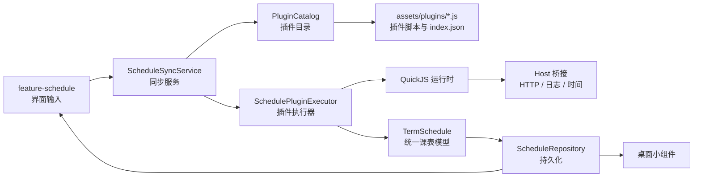
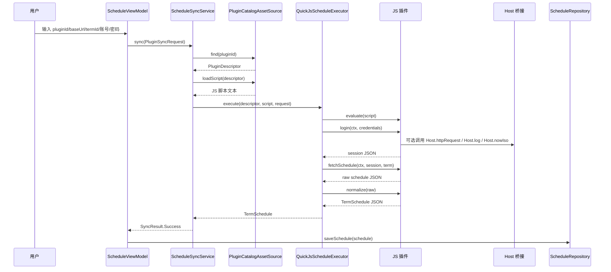

# JS 插件系统说明（当前实现）

本文档描述 `Class Schedule Viewer` 里“插件”这件事在当前代码里的真实设计，目标读者是要理解、维护、编写插件的人，而不是只想看一句协议摘要的人。

## 1. 先说结论

当前项目里的插件不是 Android 插件、Gradle 插件，也不是可热更新的外部扩展包。

它是一套：

- 以 `JavaScript` 编写
- 运行在 `QuickJS`
- 由 Android 宿主按固定协议调用
- 专门负责“登录学校系统并拉取课表”的脚本扩展机制

应用本身负责界面、数据存储和小组件；学校差异、登录流程、课表接口差异，都尽量收敛到 JS 插件里。

## 2. 为什么要做成插件

课表应用最大的变化点，不是“怎么展示课表”，而是“不同学校怎么登录、怎么拿到课表、接口长什么样”。

当前设计的核心目标是把这部分高变化逻辑隔离出来：

- App 壳层保持稳定，不需要为每个学校写一套 Kotlin 逻辑
- 学校适配逻辑用 JS 编写，开发和迭代门槛更低
- 最终所有插件都产出统一课表模型，UI、小组件、存储层不需要理解学校差异

换句话说，这是一套“宿主负责框架，插件负责采集，统一模型负责解耦”的设计。

## 3. 当前实现范围

截至当前代码，已经实现的是：

- 插件元数据注册
- 插件脚本从 APK assets 加载
- QuickJS 执行插件
- 宿主向插件暴露受控 `Host` 能力
- 固定三段式调用：`login -> fetchSchedule -> normalize`
- 将插件输出解析为统一的 `TermSchedule`
- 同步结果写入仓储，再由 UI 和小组件消费

截至当前代码，还没有实现的是：

- 在线下载/安装插件
- 插件签名校验
- 插件权限声明
- 插件 API 版本协商
- 插件市场或插件管理 UI
- 按插件列表下拉选择，当前界面仍然是手输 `pluginId`

所以这套系统现在更接近“内置脚本驱动的微内核扩展机制”，而不是“成熟的开放插件平台”。

## 4. 架构分层

与插件系统相关的模块分工如下：

| 模块 | 角色 | 当前职责 |
| --- | --- | --- |
| `app` | 组装层 | 创建插件目录、执行器、宿主桥接，并注入给业务服务 |
| `core-kernel` | 核心协议层 | 定义插件描述、同步请求、执行接口、统一课表模型 |
| `core-js` | JS 运行时层 | 用 QuickJS 执行插件，并实现 `Host` 桥接 |
| `feature-schedule` | 交互层 | 收集用户输入，发起同步，展示结果 |
| `core-data` | 数据层 | 保存课表、最近一次插件 ID、用户名、学期等信息 |
| `feature-widget` | 展示层 | 读取统一课表数据刷新桌面小组件 |

可以把它理解成下面这条链路：



## 5. 代码里有哪些核心对象

### 5.1 `PluginDescriptor`

定义在 [core-kernel/src/main/java/com/kebiao/viewer/core/kernel/plugin/PluginContracts.kt](../core-kernel/src/main/java/com/kebiao/viewer/core/kernel/plugin/PluginContracts.kt)。

它描述一个插件“是谁、叫什么、脚本入口在哪”：

```json
{
  "id": "demo-campus",
  "name": "演示教务系统插件",
  "version": "1.0.0",
  "entryAsset": "plugins/demo-campus.js",
  "description": "示例插件，演示 login/fetchSchedule/normalize 全流程。"
}
```

字段含义：

- `id`：插件唯一标识，业务层通过它找到插件
- `name`：给人看的名字
- `version`：插件自身版本号
- `entryAsset`：脚本在 APK assets 中的路径
- `description`：插件描述

### 5.2 `PluginCatalog`

它是“插件目录”的抽象接口，职责是：

- 列出全部插件
- 按 `pluginId` 找到插件
- 读取插件脚本文本

当前实现是 `PluginCatalogAssetSource`，表示插件目录不是来自数据库、网络或本地文件夹，而是来自应用内置 assets。

### 5.3 `SchedulePluginExecutor`

它是“怎么执行插件”的抽象接口。

当前实现是 `QuickJsScheduleExecutor`，也就是：

- 每次同步时创建一个新的 QuickJS 运行时
- 把宿主 `Host` 对象注入 JS 环境
- 执行插件脚本
- 按固定顺序调用插件导出的三个函数

### 5.4 `ScheduleSyncService`

它是业务真正使用的统一入口，职责很简单：

1. 按 `pluginId` 找插件
2. 读取脚本
3. 调执行器跑插件
4. 把各种异常折叠成统一的同步结果

这一步把“目录查找”“脚本加载”“QuickJS 执行”这些实现细节都挡在了业务层后面。

## 6. 插件是怎么注册和发现的

当前插件全部内置在 APK 里，位置是：

- [app/src/main/assets/plugins/index.json](../app/src/main/assets/plugins/index.json)
- [app/src/main/assets/plugins/demo-campus.js](../app/src/main/assets/plugins/demo-campus.js)

发现流程如下：

1. 宿主启动后，由 `AppContainer` 创建 `PluginCatalogAssetSource`
2. `PluginCatalogAssetSource` 读取 `assets/plugins/index.json`
3. JSON 被解析成 `PluginDescriptor` 列表
4. 结果被缓存到内存，后续 `list()` 直接复用
5. 真正执行某个插件时，再根据 `entryAsset` 读取对应 JS 文件

这意味着：

- 插件列表在打包时就确定了
- 当前没有“运行时新增插件”的能力
- 插件的脚本文件和元数据必须一起随 App 发布

## 7. 一次同步到底发生了什么

下面是当前真实调用链。



对应到当前实现，几个关键点要特别注意：

- 同步请求由界面输入构造成 `PluginSyncRequest`
- 执行器严格按 `login -> fetchSchedule -> normalize` 顺序调用
- 三个函数之间传递的都是“可 JSON 化的数据”
- 最终只有 `normalize` 的返回值会被强制解析成 Kotlin 的 `TermSchedule`

## 8. 插件协议长什么样

### 8.1 宿主传给插件的输入

当前同步请求由两部分组成：

#### `PluginContext`

```json
{
  "termId": "2026-spring",
  "baseUrl": "https://demo-campus.example",
  "extra": {}
}
```

字段含义：

- `termId`：学期标识
- `baseUrl`：教务系统基础地址
- `extra`：预留扩展字段，当前 UI 没有填充它

#### `SyncCredentials`

```json
{
  "username": "20260001",
  "password": "******",
  "captcha": null
}
```

字段含义：

- `username`：账号/学号
- `password`：密码
- `captcha`：预留验证码字段，当前 UI 没有提供入口

### 8.2 插件必须导出的三个函数

当前协议要求每个插件在全局作用域提供三个函数：

```js
function login(ctx, input) { ... }
function fetchSchedule(ctx, session, term) { ... }
function normalize(raw) { ... }
```

执行器会在脚本加载后检查这三个函数是否存在。缺任何一个，插件就会直接失败。

三个函数的职责边界应该这样理解：

#### `login(ctx, input)`

职责：

- 做登录前准备
- 发起登录请求
- 返回“后续取课表需要的会话对象”

建议返回内容：

- token
- cookie 所代表的用户信息
- 登录后首页里提取出的关键字段

注意：

- 宿主不会校验 `session` 的结构
- 只要它能被 `fetchSchedule` 再消费即可

#### `fetchSchedule(ctx, session, term)`

职责：

- 使用 `login` 返回的会话信息
- 拉取原始课表数据
- 返回学校自己的原始结构

这里最重要的是“保真”，不必为了宿主提前整理成最终结构。

#### `normalize(raw)`

职责：

- 把学校自定义的原始结构转换成统一课表模型
- 返回必须能被 Kotlin 端解析的标准 JSON

这是插件里最关键的接口，因为它决定了后续 UI、小组件和存储层是否能复用统一模型。

### 8.3 标准输出模型 `TermSchedule`

当前宿主要求 `normalize` 返回的数据能被解析为：

```json
{
  "termId": "2026-spring",
  "updatedAt": "2026-04-25T08:00:00+08:00",
  "dailySchedules": [
    {
      "dayOfWeek": 1,
      "courses": [
        {
          "id": "c1",
          "title": "高等数学",
          "teacher": "张老师",
          "location": "A101",
          "weeks": [1, 2, 3],
          "time": {
            "dayOfWeek": 1,
            "startNode": 1,
            "endNode": 2
          }
        }
      ]
    }
  ]
}
```

关键字段说明：

- `termId`：学期 ID
- `updatedAt`：更新时间，字符串格式
- `dailySchedules`：按星期几分组后的课程列表
- `dayOfWeek`：当前项目采用 `1=周一 ... 7=周日`
- `weeks`：课程在哪些教学周出现
- `time.startNode/endNode`：第几节到第几节

当前解析策略是：

- 允许 JSON 中出现额外字段，宿主会忽略它们
- 但必填字段如果缺失、类型不对，整个同步会失败

## 9. JS 插件能调用哪些宿主能力

当前只暴露了一个全局对象：`Host`。

### 9.1 `Host.httpRequest(requestJson)`

这是插件访问网络的主要入口。

请求格式：

```json
{
  "method": "GET",
  "url": "https://example.edu/api/schedule",
  "headers": {
    "User-Agent": "ClassScheduleViewer"
  },
  "body": null,
  "contentType": null,
  "timeoutMs": 15000
}
```

响应格式：

```json
{
  "status": 200,
  "headers": {
    "Content-Type": "application/json"
  },
  "body": "{...}"
}
```

行为细节：

- 底层实现是 `OkHttp`
- `GET` 和 `HEAD` 不带请求体
- 其他方法默认用 `application/json; charset=utf-8`
- 单次请求默认超时是 `15000ms`
- 插件可通过 `timeoutMs` 覆盖单次 HTTP 超时

### 9.2 `Host.log(message)`

用于把插件日志写到 Android 日志系统，方便调试登录过程和接口返回。

### 9.3 `Host.nowIso()`

用于获取当前时间字符串，适合：

- 生成签名参数
- 生成请求时间戳
- 给示例数据打更新时间

## 10. 当前实现里几个非常重要的“真实约束”

这一节很关键，因为它说的是“代码已经决定了什么”，不是理想设计。

### 10.1 插件执行是同步模型，不是异步模型

当前 `Host.httpRequest`、`Host.log`、`Host.nowIso` 都是同步调用，执行器也直接同步调用 JS 函数并立即取返回值。

这意味着：

- 插件应按同步风格写
- 不要假设这里支持 `Promise` 驱动的异步流程
- 插件中的主要控制流应该是串行的

### 10.2 每次同步都会新建一个 QuickJS 运行时

也就是说：

- 插件里的全局变量不会跨同步保留
- `login` 返回的 `session` 只在本次同步链路里有效
- 插件脚本本身是“短生命周期执行单元”

这是好事，因为它降低了脚本残留状态带来的不确定性。

### 10.3 但 HTTP Cookie 不是每次都隔离的

当前 `DefaultJsHostBridge` 在 `AppContainer` 里是单例，内部 `CookieJar` 也跟着单例存在。

而且 Cookie 的存储键是 `host`，不是 `pluginId`、不是账号、也不是一次同步会话。

这会带来两个现实结果：

- 同一域名下，前一次同步留下的 Cookie 可能影响下一次同步
- 不同插件如果访问同一个 host，也会共享 Cookie

这既可能帮你复用登录态，也可能制造调试污染。编写插件时要意识到这一点。

### 10.4 当前只有总执行超时，没有更细粒度的插件隔离

当前执行器只做了一层总超时控制：单次插件执行总时长默认 `20000ms`。

已经实现：

- 总执行超时
- 缺失函数检查
- 统一异常映射

尚未看到明确实现：

- 按插件设定内存上限
- 访问域名白名单
- API 权限声明
- 网络能力按插件隔离

所以当前系统的安全边界还比较基础，更适合“内置受控插件”场景，而不是随意装第三方插件的开放场景。

### 10.5 当前 UI 并没有真正消费插件目录

`ScheduleSyncService` 已经支持 `listPlugins()`，但当前界面不是从目录里拉列表让用户选择，而是直接让用户手填：

- 插件 ID
- 基础 URL
- 学期 ID
- 账号
- 密码

这说明系统底层已经具备“可枚举插件”的能力，但前端交互还停留在调试型输入阶段。

### 10.6 预留字段已经存在，但还没打通到界面

代码里已经预留了：

- `PluginContext.extra`
- `SyncCredentials.captcha`

这意味着协议已经为更复杂学校场景留了口子，但当前产品界面还没有把这些输入暴露出来。

## 11. 示例插件到底在演示什么

当前示例插件是 [app/src/main/assets/plugins/demo-campus.js](../app/src/main/assets/plugins/demo-campus.js)。

它的作用不是“真的适配某个学校”，而是演示插件生命周期：

1. `login` 校验用户名和密码不为空
2. `login` 返回一个伪造的 session
3. `fetchSchedule` 生成一份模拟原始课程数据
4. `normalize` 把扁平 `courses` 转成按星期分组的 `dailySchedules`

这个示例说明了两件事：

- 插件作者可以自由定义“原始数据结构”
- 但最终必须收敛到统一 `TermSchedule`

## 12. 如果现在要新增一个真实学校插件，应该怎么理解边界

新增插件时，建议按下面思路来：

1. 在 `assets/plugins/` 下新增一个 JS 文件
2. 在 `assets/plugins/index.json` 里注册它的元数据
3. 在 `login` 里处理登录
4. 在 `fetchSchedule` 里把学校原始课表拿回来
5. 在 `normalize` 里转换成统一模型
6. 在界面里输入对应的 `pluginId` 和 `baseUrl` 做联调

插件里应该做的事：

- 登录
- 保持会话
- 请求学校接口
- 解析学校返回
- 转成标准课表

插件里不应该做的事：

- 直接操作 Android UI
- 直接写 DataStore
- 直接刷新小组件
- 假设宿主有浏览器 DOM、WebView 或文件系统能力

## 13. 这套设计的优点

- 学校适配逻辑与 App 主体解耦
- 插件只关心采集和转换，业务边界清晰
- 最终统一模型让 UI 和 Widget 完全复用
- 插件目录与执行器都有抽象接口，后续能替换实现

## 14. 这套设计当前的不足

- 插件只能内置，不能动态安装
- Cookie 作用域过粗，可能污染不同同步任务
- 没有插件权限模型
- 没有插件 API 版本字段
- 缺少正式的插件选择与管理界面
- `normalize` 之外，中间对象基本没有结构约束，调试需要自觉

## 15. 一句话总结

当前插件系统本质上是一个“内置 JS 采集器框架”：

- `core-kernel` 定协议
- `core-js` 跑脚本
- `Host` 给受控能力
- 插件负责把学校世界翻译成统一课表世界

如果后面要继续演进，这套骨架已经够用了；真正要补的是插件管理、安全隔离、版本治理和更友好的配置入口。
